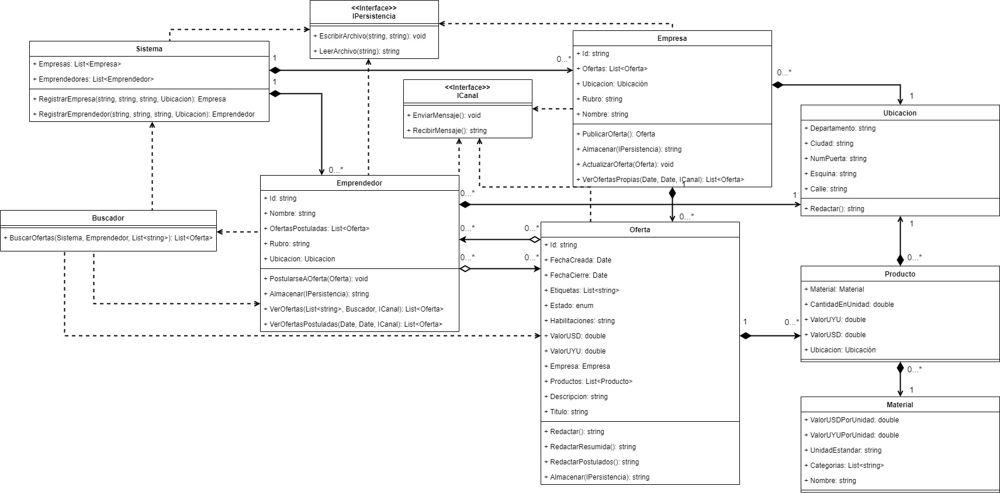

# Proyecto final de Programación II, Equipo 13
<h2>Diagrama de clases</h2>

<h2>CRC</h2>
<h3><a href="https://github.com/WalterTano/ProyectoP2/blob/main/docs/CRCs.pdf"> • CRCs en el repositorio</a></h3>
<h3><a href="https://echeung.me/crcmaker/?share=W3sibmFtZSI6IlNpc3RlbWEiLCJzdXBlcmNsYXNzZXMiOiIiLCJzdWJjbGFzc2VzIjoiIiwidHlwZSI6MSwicmVzcG9uc2liaWxpdGllcyI6WyJDb25vY2VyIHRvZGFzIGxhcyBFTVBSRVNBUy4iLCJDb25vY2VyIHRvZG9zIGxvcyBFTVBSRU5ERURPUkVTLiIsIlJlZ2lzdHJhciBFTVBSRVNBUy4iLCJSZWdpc3RyYXIgRU1QUkVOREVET1JFUy4iXSwiY29sbGFib3JhdG9ycyI6WyJFbXByZXNhIiwiRW1wcmVuZGVkb3IiLCJJUGVyc2lzdGVuY2lhIl19LHsibmFtZSI6IkJ1c2NhZG9yIiwic3VwZXJjbGFzc2VzIjoiIiwic3ViY2xhc3NlcyI6IiIsInR5cGUiOjEsInJlc3BvbnNpYmlsaXRpZXMiOlsiQ29ub2NlciBhbCBTSVNURU1BIiwiRGFkbyB1biBFTVBSRU5ERURPUiB5IHVuYSBsaXN0YSBkZSBwYWxhYnJhcyBjbGF2ZSwgcHJvdmVlciB1bmEgbGlzdGEgZGUgT0ZFUlRBUy4iXSwiY29sbGFib3JhdG9ycyI6WyJTaXN0ZW1hIiwiRW1wcmVuZGVkb3IiLCJPZmVydGEiXX0seyJuYW1lIjoiRW1wcmVzYSIsInN1cGVyY2xhc3NlcyI6IiIsInN1YmNsYXNzZXMiOiIiLCJ0eXBlIjoxLCJyZXNwb25zaWJpbGl0aWVzIjpbIkNvbm9jZXIgc3UgaWQgZW4gZWwgc2lzdGVtYSIsIkNvbm9jZXIgc3Ugbm9tYnJlIiwiQ29ub2NlciBzdSBVQklDQUNJT04iLCJDb25vY2VyIHN1IHJ1YnJvIiwiQ29ub2NlciB5IHZlciBzdXMgcHJvcGlhcyBPRkVSVEFTIChhY3RpdmFzIHkgZmluYWxpemFkYXMpIiwiQ3JlYXIgc3VzIE9GRVJUQVMiLCJBY3R1YWxpemFyIGVzdGFkbyBkZSBPRkVSVEFTIiwiRGVmaW5pciBzdSBpbmZvcm1hY2nzbiBhIGFsbWFjZW5hciJdLCJjb2xsYWJvcmF0b3JzIjpbIk9mZXJ0YSIsIlViaWNhY2lvbiIsIlRlbGVncmFtIiwiSVBlcnNpc3RlbmNpYSJdfSx7Im5hbWUiOiJFbXByZW5kZWRvciIsInN1cGVyY2xhc3NlcyI6IiIsInN1YmNsYXNzZXMiOiIiLCJ0eXBlIjoxLCJyZXNwb25zaWJpbGl0aWVzIjpbIkNvbm9jZXIgc3Ugbm9tYnJlIiwiQ29ub2NlciBzdSBVQklDQUNJT04iLCJDb25vY2VyIHN1IHJ1YnJvIiwiQ29ub2NlciBzdXMgT0ZFUlRBUyAocG9zdHVsYWRhcyB5IGNvbnN1bWlkYXMpIiwiQnVzY2FyIHkgdmVyIE9GRVJUQVMiLCJQb3N0dWxhcnNlIGEgT0ZFUlRBUyIsIkRlZmluaXIgc3UgaW5mb3JtYWNp824gYSBhbG1hY2VuYXIiXSwiY29sbGFib3JhdG9ycyI6WyJPZmVydGEiLCJVYmljYWNpb24iLCJUZWxlZ3JhbSIsIkJ1c2NhZG9yIiwiSVBlcnNpc3RlbmNpYSJdfSx7Im5hbWUiOiJPZmVydGEiLCJzdXBlcmNsYXNzZXMiOiIiLCJzdWJjbGFzc2VzIjoiIiwidHlwZSI6MSwicmVzcG9uc2liaWxpdGllcyI6WyJDb25vY2VyIHN1IHTtdHVsby4iLCJDb25vY2VyIHN1IGRlc2NyaXBjafNuLiIsIkNvbm9jZXIgc3VzIFBST0RVQ1RPUy4iLCJDb25vY2VyIGxhIEVNUFJFU0EgcXVlIGxhIGdlbmVyYS4iLCJDb25vY2VyIHN1IHZhbG9yIHRvdGFsIG1vbmV0YXJpbyAoZW4gJCB5IFUkUykuIiwiQ29ub2NlciBzdXMgaGFiaWxpdGFjaW9uZXMgcmVxdWVyaWRhcy4iLCJDb25vY2VyIHN1IGVzdGFkby4iLCJDb25vY2VyIHN1cyBwYWxhYnJhcyBjbGF2ZS4iLCJDb25vY2VyIHN1IGZlY2hhIGRlIGNyZWFjafNuLiIsIkNvbm9jZXIgc3UgZmVjaGEgZGUgY2llcnJlLiIsIkNvbm9jZXIgbG9zIEVNUFJFTkRFRE9SRVMgcG9zdHVsYWRvcyBhIGxhIG9mZXJ0YS4iLCJSZWRhY3RhciBzdSBwdWJsaWNhY2nzbiAodmVyc2nzbiBlc2NyaXRhIGRlIGxhIG9mZXJ0YSkuIiwiUmVkYWN0YXIgc3UgcHVibGljYWNp824gcmVzdW1pZGEuIiwiUmVkYWN0YXIgbGEgbGlzdGEgZGUgRU1QUkVOREVET1JFUyBwb3N0dWxhZG9zLiIsIkRlZmluaXIgc3UgaW5mb3JtYWNp824gYSBhbG1hY2VuYXIiXSwiY29sbGFib3JhdG9ycyI6WyJQcm9kdWN0byIsIkVtcHJlc2EiLCJFbXByZW5kZWRvciIsIlRlbGVncmFtIl19LHsibmFtZSI6IlByb2R1Y3RvIiwic3VwZXJjbGFzc2VzIjoiIiwic3ViY2xhc3NlcyI6IiIsInR5cGUiOjEsInJlc3BvbnNpYmlsaXRpZXMiOlsiQ29ub2NlciB1biBNQVRFUklBTC4iLCJDb25vY2VyIHN1IFVCSUNBQ0nTTi4iLCJDb25vY2VyIGxhIGNhbnRpZGFkIChlbiBzdSB1bmlkYWQpIGRlbCBNQVRFUklBTCBkaXNwb25pYmxlLiIsIkNvbm9jZXIgc3UgdmFsb3IgbW9uZXRhcmlvIHRvdGFsIGVuICQuIiwiQ29ub2NlciBzdSB2YWxvciBtb25ldGFyaW8gdG90YWwgZW4gVSRTLiJdLCJjb2xsYWJvcmF0b3JzIjpbIlViaWNhY2lvbiIsIk1hdGVyaWFsIl19LHsibmFtZSI6Ik1hdGVyaWFsIiwic3VwZXJjbGFzc2VzIjoiIiwic3ViY2xhc3NlcyI6IiIsInR5cGUiOjEsInJlc3BvbnNpYmlsaXRpZXMiOlsiQ29ub2NlciBzdSBub21icmUuIiwiQ29ub2NlciBzdXMgY2F0ZWdvcu1hcy4iLCJDb25vY2VyIHN1IHVuaWRhZCBkZSBtZWRpZGEgZXN04W5kYXIuIiwiQ29ub2NlciBzdSB2YWxvciBtb25ldGFyaW8gZW4gJCBwYXJhIHN1IHVuaWRhZCBkZSBtZWRpZGEuIiwiQ29ub2NlciBzdSB2YWxvciBtb25ldGFyaW8gZW4gVSRTIHBhcmEgc3UgdW5pZGFkIGRlIG1lZGlkYS4iXSwiY29sbGFib3JhdG9ycyI6WyIiXX0seyJuYW1lIjoiVWJpY2FjaW9uIiwic3VwZXJjbGFzc2VzIjoiIiwic3ViY2xhc3NlcyI6IiIsInR5cGUiOjEsInJlc3BvbnNpYmlsaXRpZXMiOlsiQ29ub2NlciBjYWxsZSIsIkNvbm9jZXIgZXNxdWluYSIsIkNvbm9jZXIgbnVtZXJvIGRlIHB1ZXJ0YSIsIkNvbm9jZXIgY2l1ZGFkIiwiQ29ub2NlciBkZXBhcnRhbWVudG8iLCJSZWRhY3RhciBsYSB1YmljYWNp824gcmVwcmVzZW50YWRhIl0sImNvbGxhYm9yYXRvcnMiOlsiIl19LHsibmFtZSI6IklQZXJzaXN0ZW5jaWEiLCJzdXBlcmNsYXNzZXMiOiIiLCJzdWJjbGFzc2VzIjoiIiwidHlwZSI6MSwicmVzcG9uc2liaWxpdGllcyI6WyJBbG1hY2VuYXIgaW5mb3JtYWNp824gZW4gbWVkaW9zIHBlcnNpc3RlbnRlcyIsIkxlZXIgaW5mb3JtYWNp824gZGUgbWVkaW9zIHBlcnNpc3RlbnRlcyJdLCJjb2xsYWJvcmF0b3JzIjpbIiJdfSx7Im5hbWUiOiJJQ2FuYWwiLCJzdXBlcmNsYXNzZXMiOiIiLCJzdWJjbGFzc2VzIjoiIiwidHlwZSI6MSwicmVzcG9uc2liaWxpdGllcyI6WyJSZWNpYmlyIG1lbnNhamVzIGRlIHVuIGNhbmFsIGRlIGNvbXVuaWNhY2nzbiIsIkVudmlhciBtZW5zYWplcyBhIHVuIGNhbmFsIGRlIGNvbXVuaWNhY2nzbiJdLCJjb2xsYWJvcmF0b3JzIjpbIiJdfV0="> • CRCs en CRC Maker</a></h3>
